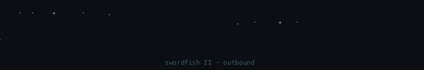
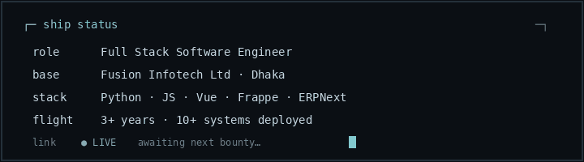

<p align="center">
  
</p>

<h1 align="center">Mahin Abrar</h1>

<p align="center">
  <b>Full Stack Software Engineer</b>
</p>

<p align="center">
  
</p>

<p align="center">
  
</p>

<p align="center">
  <a href="https://mahin-abrar.github.io/portfolio"><b>Portfolio</b></a>
  &nbsp;·&nbsp;
  <a href="https://github.com/Mahin-Abrar?tab=repositories">Projects</a>
  &nbsp;·&nbsp;
  <a href="https://linkedin.com/in/mahinabrar">LinkedIn</a>
  &nbsp;·&nbsp;
  <a href="mailto:mahinabrar25@gmail.com">Comms</a>
</p>

---

## Somewhere in this solar system

I am a full-stack engineer at [Fusion Infotech Ltd](https://github.com/Fusion-Infotech-Ltd) in Dhaka. Most days I fly the Frappe / ERPNext stack—turning messy requirements into systems that hold under real load.

The job is less about chasing shiny tech and more about clean workflows, honest interfaces, and software that still works when the crew is tired. Three years in, ten-plus systems later—still learning the map.

<p align="center">
  
</p>

---

## Selected work

| Mission | What it is |
| --- | --- |
| **HR & payroll** | HR and compensation workflows on ERPNext—config, rules, and delivery so people ops run on one stack. |
| **ERP solutions** | Custom modules and business logic that bend ERPNext toward how the organization actually operates. |
| **Ticket management** | Solo-built ticketing end to end: data model, triage, assign, close. |
| **Project management** | Planning and ownership visible from intake to done—less lost context, fewer ghost tasks. |

<p align="center">
  <a href="https://mahin-abrar.github.io/portfolio"><b>View work log</b></a>
  &nbsp;·&nbsp;
  <a href="https://github.com/Mahin-Abrar?tab=repositories">All repositories</a>
</p>

---

## Arsenal

```
  Python  ·  JavaScript  ·  Vue.js  ·  Frappe  ·  ERPNext  ·  REST
```

<p align="center">
  
  
  
  
  
</p>

---

## Current course

```
┌─ coordinates ───────────────────────────────────────────────┐
│  ERP & ops tools     Reliable Frappe apps for real crews    │
│  Full-stack delivery Frontend to data model, one trajectory │
│  Quiet craft         Clear code beats loud demos            │
└─────────────────────────────────────────────────────────────┘
```

Off-duty: photography, books, astronomy, pen sketches. Soundtrack optional. Standards set unreasonably high by *Cowboy Bebop*.

---

## Hail frequencies

<p align="center">

| Channel | Frequency |
| --- | --- |
| Portfolio | [mahin-abrar.github.io/portfolio](https://mahin-abrar.github.io/portfolio) |
| LinkedIn | [linkedin.com/in/mahinabrar](https://linkedin.com/in/mahinabrar) |
| GitHub | [github.com/Mahin-Abrar](https://github.com/Mahin-Abrar) |
| Email | [mahinabrar25@gmail.com](mailto:mahinabrar25@gmail.com) |

</p>

---

<p align="center">
  
</p>
